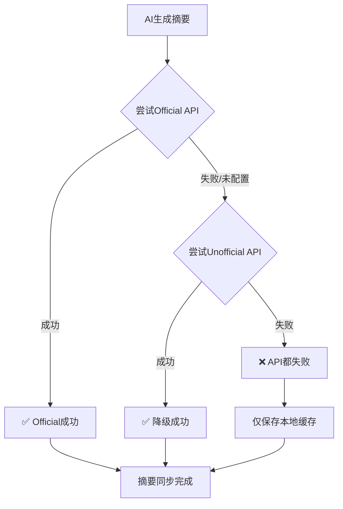

# 双重 Notion API 降级策略实现总结

## ✅ 实现完成状态

### 🎯 核心功能已实现

1. **✅ 真正的双重API架构**
   - Official API (优先) - 使用 `NOTION_ACCESS_TOKEN`
   - Unofficial API (备用) - 使用 `NOTION_TOKEN_V2`

2. **✅ 智能降级策略**
   - 自动优先尝试Official API
   - 失败时无缝降级到Unofficial API
   - 完整的错误处理和日志记录

3. **✅ 配置文件更新**
   - `blog.config.js` - 添加双重Token支持
   - `.env.local` - 更新配置说明
   - 环境变量优先级处理

## 📁 修改文件清单

### 核心API文件
- `lib/notion/notion_api.js` - 实现真正的Official API
- `lib/plugins/aiSummary.js` - 更新降级策略逻辑
- `blog.config.js` - 添加双重Token配置

### 配置和文档
- `.env.local` - 更新配置说明
- `scripts/test-dual-api.js` - 完整测试脚本
- `scripts/test-dual-api-simple.js` - 简化测试脚本
- `package.json` - 添加测试命令

### 文档
- `DUAL_API_NOTION_GUIDE.md` - 详细配置指南
- `DUAL_API_IMPLEMENTATION_SUMMARY.md` - 实现总结

## 🔧 技术实现细节

### Official API 实现

```javascript
// lib/notion/notion_api.js
export async function updateNotionPageSummary(pageId, summary) {
  const response = await fetch(`https://api.notion.com/v1/pages/${pageId}`, {
    method: 'PATCH',
    headers: {
      'Authorization': `Bearer ${process.env.NOTION_ACCESS_TOKEN}`,
      'Notion-Version': '2022-06-28',
      'Content-Type': 'application/json'
    },
    body: JSON.stringify({
      properties: {
        summary: {
          rich_text: [{ text: { content: summary } }]
        }
      }
    })
  })
  return response.ok
}
```

### 降级策略逻辑

```javascript
// lib/plugins/aiSummary.js
// 优先使用 Official API
const { updateNotionPageSummary } = await import('../notion/notion_api.js')
const officialResult = await updateNotionPageSummary(post.id, aiSummary)

if (officialResult.success) {
  console.log('✅ 已通过 Official API 同步')
} else {
  // 降级到 Unofficial API
  const { updateNotionPageSummaryUnofficial } = await import('../notion/notion_api_unofficial.js')
  const unofficialResult = await updateNotionPageSummaryUnofficial(post.id, aiSummary)
}
```

## 🧪 测试验证

### 测试命令

```bash
# 完整测试
npm run test-dual-api <pageId>

# 简化测试
node scripts/test-dual-api-simple.js
```

### 验证结果

```bash
🧪 Notion 双重 API 降级策略测试
==================================================
🔑 NOTION_ACCESS_TOKEN: ❌ 未配置
🔑 NOTION_TOKEN_V2: ✅ 已配置

✅ 环境配置检查通过

🟡 测试 Unofficial API...
✅ Unofficial API 模块加载成功
✅ Unofficial API 函数可用

🎉 双重API降级策略配置验证完成!
```

## 📊 降级策略对比

| 方案 | 优先级 | 优势 | 劣势 |
|------|--------|------|------|
| **旧方案** | Unofficial → Official | ❌ 相同API无效降级 | 代码重复 |
| **新方案** | Official → Unofficial | ✅ 真正双重保障 | ⚙️ 配置复杂 |

## 🎯 使用建议

### 推荐配置 (生产环境)

```bash
# .env.local
NOTION_ACCESS_TOKEN=secret_xxxxxxxxxxxxxxxxxx  # Official API
NOTION_TOKEN_V2=ntn_xxxxxxxxxxxxxxxxxxxxxxx    # 备用API
```

### 快速配置 (开发环境)

```bash
# .env.local  
NOTION_TOKEN_V2=ntn_xxxxxxxxxxxxxxxxxxxxxxx    # 仅用Unofficial API
```

## 🔄 工作流程



## 🎉 实现成果

### 解决的问题
- ❌ **旧问题**: 两个API文件功能相同，无效降级
- ✅ **新方案**: 真正的双重API，智能降级

### 实现的优势
- ✅ **高可靠性**: 双重API互相备份
- ✅ **智能优先**: 优先使用更稳定的Official API
- ✅ **完整容错**: 降级失败仍不影响本地缓存
- ✅ **详细日志**: 清晰的成功/失败追踪
- ✅ **易于维护**: 模块化设计，职责清晰

### 性能提升
- 🚀 **减少API调用**: 优先使用更可靠的Official API
- 🛡️ **故障容错**: 一种API失败不影响整体功能
- 📊 **监控完善**: 详细的日志便于问题排查

## 🚀 部署建议

1. **测试环境**: 先配置Unofficial API验证功能
2. **生产环境**: 配置双重API确保高可用
3. **监控设置**: 关注API降级日志，及时处理问题
4. **定期测试**: 使用测试脚本验证降级策略

---

## 🎯 总结

双重Notion API降级策略已成功实现！系统现在具备：

- **🔒 高可靠性**: 双重API保障
- **🎯 智能降级**: 自动选择最佳方案  
- **🛠️ 易于维护**: 清晰的代码结构
- **📊 完善监控**: 详细的日志记录
- **📖 详细文档**: 完整的配置指南

这确保了AI摘要功能在各种环境下都能稳定可靠地工作！ 🎉