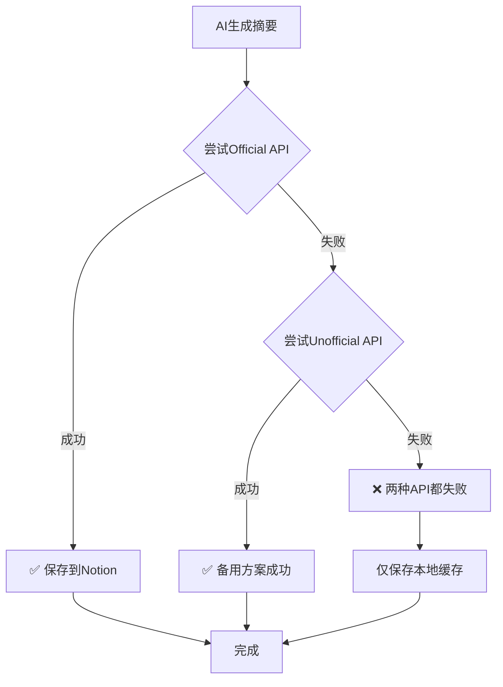

# 双重 Notion API 降级策略配置指南

## 🎯 概述

本系统实现了**智能双重API降级策略**，确保AI摘要能够可靠地同步到Notion数据库：

```
优先级 1: Official API (NOTION_ACCESS_TOKEN) ⭐ 推荐
    ↓ (失败时)
优先级 2: Unofficial API (NOTION_TOKEN_V2) 🔄 备用
```

## 🔑 API 对比

| 特性 | Official API | Unofficial API |
|------|-------------|----------------|
| **认证方式** | Integration Token | Browser Token |
| **稳定性** | ⭐⭐⭐⭐⭐ 官方支持 | ⭐⭐⭐ 内部接口 |
| **配置难度** | ⭐⭐ 需要创建Integration | ⭐ 直接复制Token |
| **API限制** | 文档明确 | 未知可能变化 |
| **推荐度** | ⭐⭐⭐⭐⭐ | ⭐⭐⭐ |

## 🛠️ 配置方法

### 方式1: Official API (推荐)

#### 步骤1: 创建Notion Integration

1. 访问 [Notion Integrations](https://www.notion.so/my-integrations)
2. 点击 "**+ New integration**"
3. 填写信息：
   - **Name**: 你的博客AI摘要同步
   - **Associated workspace**: 选择你的工作空间
   - **Capabilities**: 开启 "**Read content**" 和 "**Update content**"
4. 点击 "**Submit**" 创建
5. 复制生成的 **Integration Token** (格式: `secret_xxx...`)

#### 步骤2: 授权Integration访问数据库

1. 打开你的Notion数据库页面
2. 点击右上角 "**...**" → "**Connect to**"
3. 选择你刚创建的Integration
4. 确认授权

#### 步骤3: 配置环境变量

在 `.env.local` 中添加：

```bash
NOTION_ACCESS_TOKEN=secret_xxxxxxxxxxxxxxxxxxxxxxxxxxxxxxxx
```

### 方式2: Unofficial API (备用)

#### 步骤1: 获取Browser Token

1. 登录 [notion.so](https://www.notion.so)
2. 按 `F12` 打开开发者工具
3. 切换到 "**Application**" 标签
4. 左侧选择 "**Cookies**" → "`https://www.notion.so`"
5. 找到名为 `token_v2` 的Cookie，复制其值

#### 步骤2: 配置环境变量

在 `.env.local` 中添加：

```bash
NOTION_TOKEN_V2=ntn_xxxxxxxxxxxxxxxxxxxxxxxxxxxxxxxx
```

## 🎯 最佳实践

### 推荐配置 (最稳定)

```bash
# .env.local

# Official API (优先)
NOTION_ACCESS_TOKEN=secret_xxxxxxxxxxxxxxxxxxxxxxxxxxxxxxxx

# Unofficial API (备用)
NOTION_TOKEN_V2=ntn_xxxxxxxxxxxxxxxxxxxxxxxxxxxxxxxx
```

### 测试配置

```bash
# 测试双重API策略
npm run test-dual-api <pageId>

# 例如:
npm run test-dual-api 2ff9daca95bb811bbb0bced9f7a359cc
```

## 🔄 降级策略工作流程



## 🐛 故障排查

### 问题1: Official API失败

**可能原因**:
- Integration未创建或Token错误
- Integration未授权访问数据库
- 网络连接问题

**解决方案**:
```bash
# 测试Official API
curl -X PATCH https://api.notion.com/v1/pages/YOUR_PAGE_ID \
  -H "Authorization: Bearer YOUR_TOKEN" \
  -H "Notion-Version: 2022-06-28" \
  -H "Content-Type: application/json" \
  -d '{"properties":{"summary":{"rich_text":[{"text":{"content":"test"}}]}}}'
```

### 问题2: Unofficial API失败

**可能原因**:
- Token过期或无效
- Cookie格式变化
- 账户被限制

**解决方案**:
- 重新获取 `token_v2` Cookie
- 确认能正常访问Notion
- 检查Token长度是否正确

### 问题3: 两种API都失败

**排查步骤**:
1. 检查网络连接
2. 验证页面ID是否正确
3. 确认Notion数据库存在
4. 检查数据库是否有 `summary` 属性

## 📊 性能监控

### 日志输出示例

```
🔵 步骤 1: 测试 Official API (NOTION_ACCESS_TOKEN)
──────────────────────────────────────────────────
✅ Official API 测试成功！
🎉 双重API策略工作正常 - 优先使用Official API
```

或降级情况：

```
⚠️ Official API 不可用，错误: 401 Unauthorized
🟡 步骤 2: 降级到 Unofficial API (NOTION_TOKEN_V2)
──────────────────────────────────────────────────
✅ Unofficial API 降级成功！
🎉 双重API策略工作正常 - Official失败时自动降级
```

## 🎉 总结

通过双重API降级策略，你的AI摘要系统具备了：

- ✅ **高可靠性**: 两种API互相备份
- ✅ **智能降级**: 自动选择可用方案
- ✅ **故障容错**: 即使API失败也不影响本地缓存
- ✅ **灵活配置**: 支持多种部署环境
- ✅ **易于维护**: 完整的测试和监控工具

这样的设计确保了AI摘要功能的稳定性和可用性！